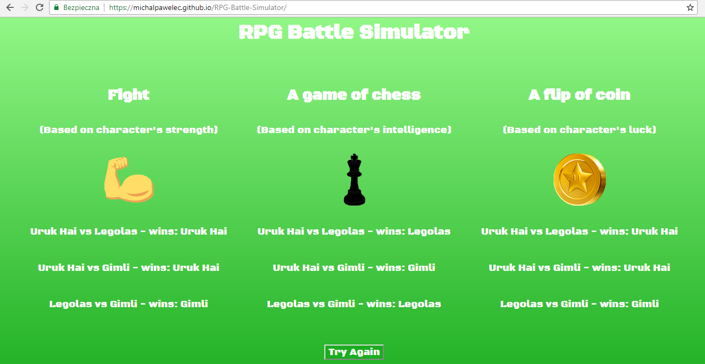

# RPG-Battle-Simulator in JQuery and ES6

> A simple mini-game in JQuery based on classes in ES6.

There are three classes (orc, elf and dwarf). Each one has basic stats, everytime you can draw them from given range and check who wins this time.

You can play it here: https://michalpawelec.github.io/RPG-Battle-Simulator/

## Used technologies and tools:
* JQuery
* JavaScript (ES6)
* CSS3
* HTML5
* RWD
